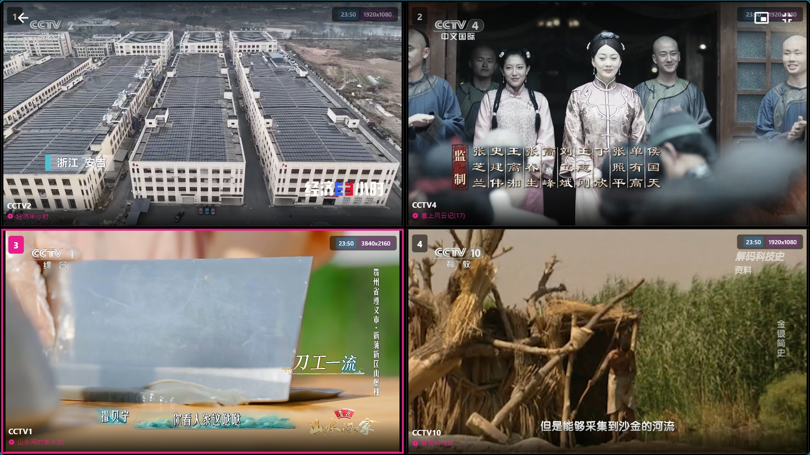

# Lotus IPTV

<p align="center">
  
</p>

<p align="center">
  <strong>现代化 IPTV 播放器 - 支持 Windows、Android 和 Android TV</strong>
</p>

<p align="center">
  <a href="https://github.com/shnulaa/FlutterIPTV/releases">
    
  </a>
  <a href="https://github.com/shnulaa/FlutterIPTV/actions/workflows/build-release.yml">
    
  </a>
  <a href="https://github.com/shnulaa/FlutterIPTV/releases">
    
  </a>
</p>

<p align="center">
  <a href="README.md">English</a> | <strong>中文</strong>
</p>

Lotus IPTV 是一款基于 Flutter 开发的现代化高性能 IPTV 播放器。采用精美的莲花主题 UI，粉紫渐变色调，针对桌面、移动端和电视平台进行了深度优化。


## 📸 软件截图

<p align="center">
  
  
  
  
  
  
</p>

## ✨ 功能特性

### 🎨 莲花主题 UI
- 纯黑背景搭配莲花粉紫渐变色调
- 玻璃拟态风格卡片（桌面/移动端）
- TV 端专属优化界面，流畅性能
- 自动折叠侧边栏导航

### 📺 多平台支持
- **Windows**: 桌面优化 UI，支持键盘快捷键和迷你模式
- **Android 手机**: 触摸友好界面，支持手势控制
- **Android TV**: 完整 D-Pad 导航，遥控器全面支持

### ⚡ 高性能播放
- **桌面/移动端**: 基于 `media_kit` 硬件加速
- **Android TV**: 原生 ExoPlayer (Media3) 支持 4K 视频播放
- 实时 FPS 帧率显示（可在设置中配置）
- 视频参数显示（分辨率、编解码器信息）
- 支持 HLS (m3u8)、MP4、MKV、RTMP/RTSP 等多种格式

### 📂 智能播放列表管理
- 支持从本地文件或 URL 导入 M3U/M3U8 播放列表
- 二维码导入，方便手机到电视的快速传输
- 根据 `group-title` 自动分组
- 保持 M3U 文件原始分类顺序
- 频道可用性检测，支持批量操作

### ❤️ 用户功能
- 收藏管理，支持长按操作
- 频道搜索（按名称或分组）
- 播放器内分类面板（按左键打开）
- 双击返回键退出播放器（防止误触）
- 观看历史记录
- 缺失台标时显示默认图标
- **多源切换**: 同名频道自动合并，左右键切换源
- **分屏模式** (桌面端): 2x2 分屏同时观看 4 个频道，独立 EPG 显示，支持迷你模式

### 📡 EPG 电子节目单
- 支持 XMLTV 格式 EPG 数据
- 自动从 M3U 的 `x-tvg-url` 属性加载 EPG
- 设置中可手动配置 EPG 地址
- 播放器中显示当前和即将播出的节目
- 节目剩余时间提示

### 📺 DLNA 投屏
- 内置 DLNA 渲染器 (DMR) 服务
- 支持从其他设备投屏到 Lotus IPTV
- 支持常见视频格式
- 投屏设备可控制播放（播放/暂停/快进/音量）
- 可设置自动启动 DLNA 服务


## 🚀 下载安装

从 [Releases 页面](https://github.com/shnulaa/FlutterIPTV/releases/latest) 下载最新版本。

### 支持平台
- **Windows**: x64 安装包 (.exe)
- **Android 手机**: APK (arm64-v8a, armeabi-v7a, x86_64)
- **Android TV**: APK (arm64-v8a, armeabi-v7a, x86_64)

## 🎮 操作控制

| 动作 | 键盘 | 电视遥控器 |
|------|------|-----------|
| 播放/暂停 | 空格/回车 | 确认键 |
| 上一频道 | ↑ | D-Pad 上 |
| 下一频道 | ↓ | D-Pad 下 |
| 打开分类面板 | ← | D-Pad 左 |
| 收藏 | F | 长按确认键 |
| 静音 | M | - |
| 退出播放器 | 双击 Esc | 双击返回键 |

## 🛠️ 开发构建

### 环境要求
- Flutter SDK (>=3.5.0)
- Android Studio（用于 Android/TV 构建）
- Visual Studio（用于 Windows 构建）

### 构建步骤
```bash
git clone https://github.com/shnulaa/FlutterIPTV.git
cd FlutterIPTV
flutter pub get

# 运行
flutter run -d windows
flutter run -d <android_device>

# 构建发布版
flutter build windows
flutter build apk --release
```

## 🤝 参与贡献

欢迎提交 Pull Request！

## ⚠️ 免责声明

本应用程序仅作为播放器，不提供任何内容。用户需自行提供 M3U 播放列表。开发者不对通过本应用播放的内容承担任何责任。

## 📄 许可证

本项目采用 MIT 许可证。
